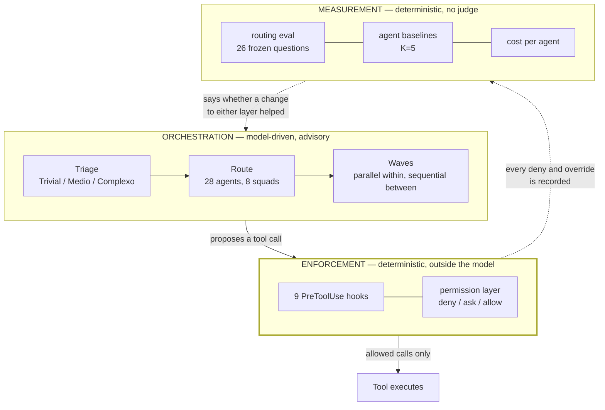
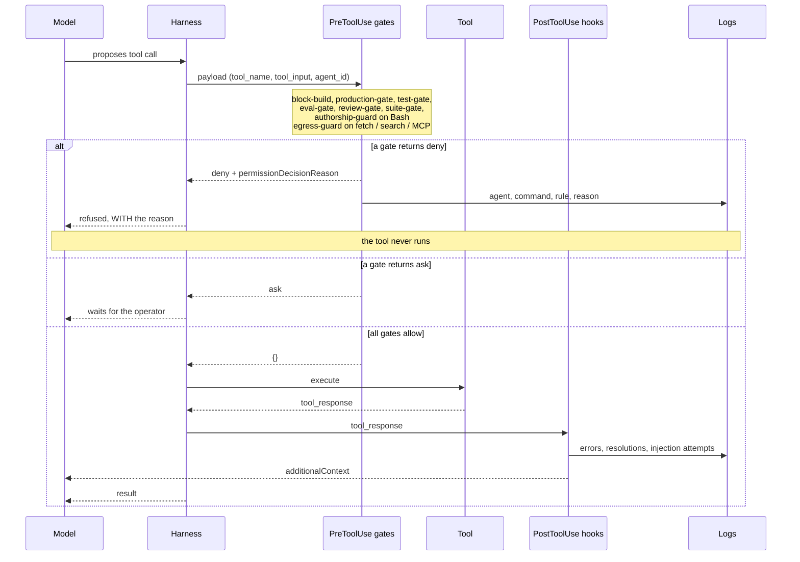
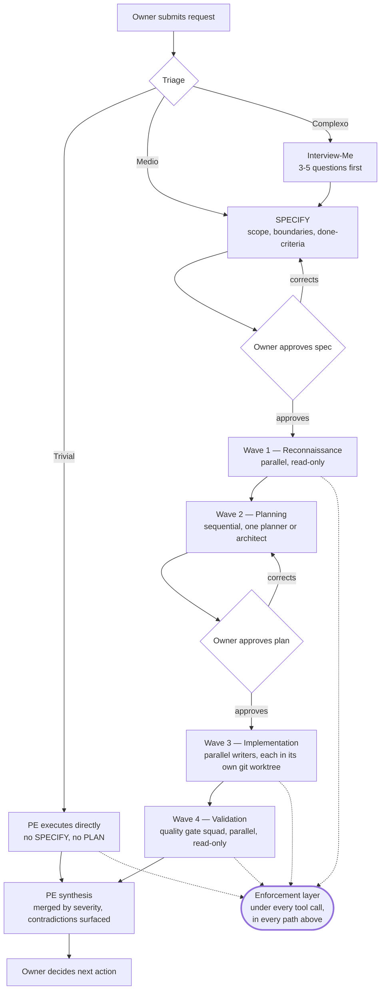

# Quarterdeck Architecture

A command-and-control system for orchestrating 28 specialized AI agents in parallel, plus the
two layers that keep it honest: controls that run outside the model, and evals that say whether
any of it works.

See [README](../README.md) for overview.

---

## Three layers

Most of this document describes the orchestration layer. It is the least load-bearing of the
three. Agent definitions are prompts; prompts are easy to copy and impossible to trust on their
own.



The middle layer is the load-bearing one. The top layer describes what the model is *asked* to
do; only the middle decides what it is *allowed* to do.

**Orchestration** decides who does the work. It runs inside the model, so it is guidance: the
routing tables, the squad structure and the wave rules below all describe what the model is
asked to do, not what it is prevented from doing.

**Enforcement** decides what is allowed to happen. Every gate is a shell script the harness
invokes before a tool call, and it returns `deny`, `ask` or `allow`. A model that is confidently
wrong cannot argue past a process that already returned `deny`. This layer does not read the
orchestration rules and does not care whether the model agrees with it.

| Gate | Event | Refuses |
|---|---|---|
| `production-gate` | Bash | modifying commands on a production host; read-only passes |
| `block-build` | Bash | heavy builds on the host |
| `egress-guard` | WebFetch, WebSearch, `mcp__*` | PII, secrets or infrastructure identifiers leaving the machine |
| `authorship-guard` | Bash | commits and PRs that credit a tool or carry emoji |
| `review-gate` | Bash | `git commit` when this exact diff has no review |
| `eval-gate` | Bash | `git commit` when an agent changed and its eval is older |
| `test-gate` | Bash | `git commit` without evidence the suite ran against this code |
| `suite-gate` | Bash | `git commit` when the guardrail suite fails on the staged files |

Shared behaviour lives in `hooks/lib/hook-common.sh`: payload parsing, path expansion, the deny
response, override handling, and the audit record. One copy, because three hooks independently
reimplemented path handling and two of them shipped the same defect.

### Where a hook actually sits

Every tool call passes through the same path. The gates are not called by the model and cannot
be skipped by it.



Two details that decide whether any of this works:

- A gate that fails to emit a decision is read as **allow**. Silence is permission, so a gate
  that errors is a gate that is off. This is why every hook exits 0 and returns explicit JSON.
- On the `deny` branch the reason travels on `permissionDecisionReason`. On the PostToolUse
  branch anything the model must act on travels on `additionalContext`. `systemMessage` reaches
  the operator on both branches and reaches the model on neither.

**Measurement** decides whether a change to either layer above helped. It is deterministic by
construction: no model judges another model's output anywhere in it. See the README for the
numbers and the method.

---

## Two channels, and why it matters

A hook can speak to the operator or to the model, and they are not the same channel.

| Field | Reaches |
|---|---|
| `systemMessage` | the operator only; never enters the context window |
| `hookSpecificOutput.additionalContext` | the model, wrapped in a system reminder |
| `permissionDecisionReason` | the model, but only on a deny |

Four hooks here spent their entire existence emitting `systemMessage` for messages the model was
supposed to act on. They ran, exited 0, wrote their logs, and delivered nothing. Any hook whose
purpose is to inform the model must emit `additionalContext`; a deny must carry
`permissionDecisionReason`, or the model is refused with no reason and routes around it.

---

## System Model

```
Owner (decision-maker)
    ↓ directs
Principal Engineer (PE)
    ↓ orchestrates
28 Agents (specialists execute)
```

**Absolute rule:** Agents NEVER act independently. The PE coordinates all work and presents results to the Owner, who decides.

### Roles

| Role | Who | Responsibility |
|------|-----|---|
| **Owner** | You — the person using Claude Code | Give requests, approve plans, make decisions |
| **PE** | Claude Code with Quarterdeck rules | Interpret requests, decompose into waves, coordinate parallel agents, synthesize results |
| **Agent** | 28 specialized `.md` files | Execute focused task, report findings, follow PE delegation |

---

## The 28 Agents Organized into 8 Squads

### Planning & Design Squad

Design and architecture decisions before building.

| Agent | Model | Role |
|---|---|---|
| **architect** | Opus | HOW to build — patterns, trade-offs, alternatives |
| **planner** | Opus | IN WHAT ORDER to build — phases, risks, dependencies |

### Quality Gate Squad

Validate without modifying. ALWAYS runs in PARALLEL.

| Agent | Model | Role |
|---|---|---|
| **code-reviewer** | Sonnet | Code quality, bugs, patterns, maintainability |
| **security-reviewer** | Opus | Infrastructure security: SSH, firewall, SSL, credentials, hardening |
| **ux-reviewer** | Sonnet | Accessibility, visual consistency, interaction states |
| **staff-engineer** | Opus | Cross-system impact, tech debt, pattern propagation |
| **blue-team** | Opus | Detection coverage and incident readiness, designed before an attack |

### Implementation Squad

Write code. Parallel writers each get their own git worktree, so a file conflict is impossible rather than prohibited.

| Agent | Model | Role |
|---|---|---|
| **tdd-guide** | Sonnet | TDD: tests first, 80%+ coverage, unit + integration tests |
| **e2e-runner** | Sonnet | End-to-end tests with Playwright, user journeys |
| **build-error-resolver** | Haiku | Fix build errors with minimal diff |
| **refactor-cleaner** | Sonnet | Remove dead code, consolidate duplicates |
| **design-specialist** | Sonnet | Builds polished UI; distinct from ux-reviewer, which only audits |

### ⚙️ Operations Squad

Keep the system running: deploy, monitor, optimize.

| Agent | Model | Role |
|---|---|---|
| **incident-responder** | Opus | Production diagnosis (read-only; recommends, doesn't execute) |
| **devops-specialist** | Sonnet | CI/CD, deploys, systemd, monitoring setup |
| **performance-optimizer** | Sonnet | CPU/memory/query bottlenecks, caching, tuning |
| **database-specialist** | Sonnet | PostgreSQL: schema, migrations, slow queries, indexes |

### Intelligence Squad

Research, documentation, knowledge capture.

| Agent | Model | Role |
|---|---|---|
| **deep-researcher** | Opus | Multi-source web research, triangulation, confidence scoring |
| **doc-updater** | Haiku | Generate documentation from actual code |

### Language Squad

Text review (read-only). Single-language scope each.

| Agent | Model | Role |
|---|---|---|
| **ortografia-reviewer** | Sonnet | PT-BR: spelling, grammar, agreement, register |
| **grammar-reviewer** | Sonnet | EN-US: spelling, grammar, punctuation, style |

### Strategy Squad

Specialized consulting.

| Agent | Model | Role |
|---|---|---|
| **seo-reviewer** | Sonnet | Technical SEO: Core Web Vitals, structured data, crawlability |
| **tech-recruiter** | Sonnet | Job descriptions, candidate evaluation, market validation |

### Editorial Squad

Professional content production with verified sources. Full pipeline: **pauta → apuração → redação → verificação → edição → revisão ortográfica**.

| Agent | Model | Role |
|---|---|---|
| **editor-chefe** | Opus | Direction: story angle, editorial line, approval |
| **jornalista** | Sonnet | Investigation, interviews, source triangulation |
| **redator** | Sonnet | Writing: lead, narrative, voice, rhythm |
| **escritor-tecnico** | Sonnet | Technical: IMRAD, Diataxis, ADRs, design docs |
| **fact-checker** | Opus | Verification (Rule of Two): 3+ source triangulation |
| **editor-de-texto** | Sonnet | Final editing: cuts, lead polish, legal language |

**Recommended pipeline:**
```
editor-chefe → jornalista → redator → fact-checker → editor-de-texto → ortografia-reviewer
```

---

## Request Lifecycle



Read-only agents need no isolation, since concurrent reads cannot conflict. Write-agents get a
separate git worktree instead of a prompt telling them which files to stay inside: a zone in a
prompt is a request, a separate checkout is a guarantee.

The dotted edges matter. The enforcement layer is not a stage in this flow; it sits under every
tool call in every wave, including the ones the Owner already approved. Approving a plan is not
approving the commands that implement it.

### Wave-Based Execution

Instead of sequential chains, the PE groups work into **waves**:
- **Within a wave:** agents run in PARALLEL (no dependencies between them)
- **Between waves:** sequential (next wave depends on previous results)

Example for "Implement JWT authentication":

```
Wave 1 — Reconnaissance (3 agents PARALLEL):
  ├── Explore: current auth code
  ├── Explore: test coverage
  └── deep-researcher: JWT best practices

Wave 2 — Planning (1 agent SEQUENTIAL):
  └── planner: creates phased plan

     → PE presents plan to Owner for approval ✓

Wave 3 — Implementation (1 agent SEQUENTIAL):
  └── tdd-guide: tests-first implementation

     → PE shows code to Owner ✓

Wave 4 — Validation (2 agents PARALLEL):
  ├── code-reviewer: quality check
  └── security-reviewer: auth security
```

**Result:** What could be 4 sequential steps runs in 4 waves with internal parallelism.

---

## Built-In Workflows

The PE automatically selects workflow patterns based on your request:

| When you say | PE route | Agents involved |
|---|---|---|
| "Implement feature X" | new-feature | planner → tdd-guide → code-reviewer + security |
| "Fix the login bug" | bug-fix | tdd-guide → code-reviewer |
| "Refactor auth module" | refactor | architect → refactor-cleaner → code-reviewer |
| "System is down!" | incident | incident-responder (read-only triage) → devops |
| "Review PR #42" | review-pr | code-reviewer + security + ux (all parallel) |
| "Audit the project" | audit | security + performance + code-reviewer (all parallel) |

---

## Parallel Execution Rules

### Hard Constraints

1. **Max 5 agents per wave** — diminishing returns beyond this; cost explodes 15× per additional agent
2. **Read-only agents always parallelize** — no conflict risk (code-reviewer, security-reviewer, etc.)
3. **Write agents get worktree isolation** — a separate checkout per agent; a zone in a prompt is a request, a checkout is a guarantee
4. **PE is the only synthesizer** — agents don't see each other's output; PE collects and merges
5. **Failed agent doesn't block others** — PE handles via graceful degradation

### Zone Assignment (Conflict Prevention)

When parallel write-agents exist:

```
PE maps file zones:
  tdd-guide zone: src/auth/**, tests/auth/**
  devops zone:    .github/workflows/**, Dockerfile

PE verifies: no file overlap ✓

PE spawns both with explicit assignment:
  "Your zone: src/auth/**. Do NOT modify outside this zone."
```

### Fan-Out / Fan-In Pattern

For independent sub-tasks:

```
1. PE decomposes request into N independent tasks
2. PE spawns N agents in parallel (fan-out)
   - Each gets: description, zone, output contract
3. PE collects all results
4. PE synthesizes into unified answer (fan-in)
5. PE presents single coherent result to Owner
```

---

## Agent Context Protocol

Every agent receives a **context preamble** before acting:

```
---context---
project: [project name]
stack: [languages, frameworks, DB]
path: [local path or remote: ssh your-server]
services: [systemd services, if applicable]
state: [git status, service status]
scope: [files/areas involved]
constraints: [production gate, SSH-only, custom tooling, etc.]
---end-context---

## Objective
[1 sentence — what must be accomplished]

## Output format
[Expected structure: Markdown sections, key sections]

## Boundaries
[What is OUT of scope: files NOT to touch, decisions NOT to make]
```

This ensures agents understand project context and constraints before proposing changes.

---

## Output Format

All agents return in the same structured format:

```markdown
### FINDINGS (ordered by severity)
- **[CRITICAL]** SQL injection vulnerability in users endpoint
- **[HIGH]** Missing rate limiting on auth routes

### NEXT STEP
Fix the SQL injection before merging.

### SUMMARY
The users endpoint had a SQL injection risk from string concatenation.
Analyzed all endpoints in the auth module; verified query patterns.
Found 1 CRITICAL + 2 MEDIUM issues with suggested fixes.
```

Format: **FINDINGS + SEVERITY + NEXT STEP + SUMMARY**. Owner reads it once and knows what matters.

---

## Orchestration Principles

### 1. Triage First

PE classifies every request:

| Level | Scope | Gates | Example |
|---|---|---|---|
| **Trivial** | 1-2 tools, 1 file | None | typo fix, file read |
| **Médio** | 3-10 tools, 2-5 files | SPECIFY | bug fix, endpoint |
| **Complexo** | 10+ tools, 5+ files, multi-agent | SPECIFY + PLAN | new feature, refactor |

### 2. Specification Discipline

For Médio and Complexo requests, PE writes a spec:

```
### SPEC: [title]
- **O que**: precise description
- **Por que**: problem solved / value added
- **Escopo**: affected files/areas
- **Fora de escopo**: what won't be done
- **Critério de sucesso**: how to verify
- **Complexidade**: level classification
```

Owner confirms spec before proceeding.

### 3. Debate Before Consensus

The PE (and agents) are **advisors**, not executors:
- Challenge suspicious requests
- Propose alternatives with trade-offs
- Reference historical context and decisions
- Never auto-resolve ambiguities
- Owner owns all final decisions

### 4. Zero Assumption Protocol

All agents (and PE) follow strict verification:

**Phase 1:** Extract business rule FIRST
- What does the system do? Why does it do it?
- What are the invariants/policies?

**Phase 2:** Validate against actual code
- Read full files, not snippets
- Map conventions and patterns
- Verify schema, not guess
- Check live state (DB, services, configs)

**Phase 3:** Cross-reference
- Rule (Phase 1) must match code (Phase 2)
- If divergence → report it, never fix silently
- Divergence means bug, debt, or outdated rule

---

## Sketch: Typical New-Feature Flow

```
Owner: "Add two-factor authentication"

PE: (Triage) → Complexo
    → Interview Owner (dependencies? existing code? deadline?)
    → Write spec, present to Owner

Owner: "Approved"

PE: (Plan Wave)
    → Spawn planner + deep-researcher (parallel)
    → planner reads existing auth code, creates 3-phase plan
    → deep-researcher gathers 2FA best practices
    → PE presents merged plan to Owner

Owner: "Looks good"

PE: (Implementation Wave)
    → Spawn tdd-guide (zone: auth/, models/)
    → tdd-guide writes failing tests, implements features
    → Minimal incremental commits

PE: (Validation Wave)
    → Spawn code-reviewer + security-reviewer (parallel)
    → Both review implementation
    → security-reviewer checks for TOTP timing attacks, backup codes, etc.

PE: (Synthesis)
    → Merges findings by severity
    → "CRITICAL: no rate-limit on 2FA endpoint"
    → "HIGH: backup codes not rotatable"
    → Presents to Owner with NEXT STEP

Owner: (Decides)
    → Approve merging after fixes
    OR ask for changes
    OR escalate to incident-responder
```

---

## Model Selection Strategy

Quarterdeck distributes models by task complexity (cost optimization):

| Agent | Model | Why |
|---|---|---|
| architect, planner, deep-researcher, security-reviewer, incident-responder, editor-chefe, fact-checker | **Opus** | Deep reasoning, complex decisions, high-stakes review |
| code-reviewer, tdd-guide, e2e-runner, refactor-cleaner, ux-reviewer, devops, database, + others | **Sonnet** | Best cost/quality balance; 79.6% SWE-bench (near-Opus) |
| build-error-resolver, doc-updater | **Haiku** | Simple, scoped tasks; 5× cheaper |

Total: ~15% Opus, ~75% Sonnet, ~10% Haiku. Optimizes cost while preserving quality where it matters.

---

## Customization

Agents are generic but customizable. Edit frontmatter in any `.md` file:

```yaml
model: opus          # Change reasoning depth
tools: Read, Grep    # Limit available tools
```

See [CUSTOMIZATION.md](CUSTOMIZATION.md) for full guide.

---

## See Also

- [AGENTS.md](AGENTS.md) — Full catalog with tools and examples
- [CRAWLER-PROTOCOL.md](CRAWLER-PROTOCOL.md) — Wave execution in depth
- [OUTPUT-FORMAT.md](OUTPUT-FORMAT.md) — Agent output examples
- [../rules/principal-engineer-always-on.md](../rules/principal-engineer-always-on.md) — Complete PE orchestration rules
